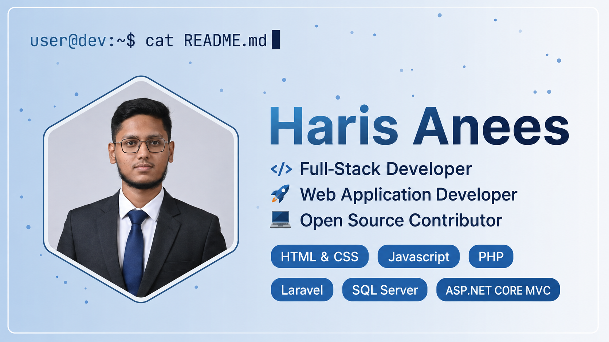

<!-- Profile Views Counter -->
<p align="center">
  
</p>

<!-- Banner Image -->
<p align="center">
  
</p>

<!-- Animated Lanyard ID Badge -->
<div align="center">
  
</div>

# Hi 👋, I'm Haris Anees


### 🔐 Cybersecurity Student | 💻 PHP Developer | 🚀 Backend Developer

Passionate about building secure, scalable web applications and continuously learning modern technologies.

---

# 🚀 About Me

- 🎓 **Bachelor in Cybersecurity**
- 💻 **PHP Backend Developer**
- 🔐 **Passionate about Secure Web Applications**
- 🌱 **Currently improving:** Laravel & Advanced PHP
- 🛠 **Love solving:** Backend problems & System Architecture
- 📚 **Learning:** Something new every day
- ⚡ **Fun fact:** I speak in code more than I speak in English

---

# 🛠 Tech Stack

<div align="center">

### Languages


### Frameworks & Libraries


### Databases


### Tools


</div>

---

# 📊 GitHub Analytics

<div align="center">
  
  
</div>

---

# 🔥 GitHub Streak

<div align="center">
  
</div>

---

# 📈 Contribution Graph

<div align="center">
  
</div>

---

# 🏆 Achievements

<div align="center">
  <a href="https://github.com/HarisAnees?tab=achievements">
    
  </a>
  <br><br>
  
</div>

---

# 📌 Featured Projects

| Project | Description | Tech Stack |
|---------|-------------|------------|
| 🔐 Secure Authentication System | Email OTP, Password Hashing, RBAC | PHP, MySQL |
| 📰 CMS Development | TinyMCE, SEO URLs, Version Control | PHP, JavaScript |
| ☕ Coffee Time Website | Modern Responsive Coffee Shop | HTML, CSS, JS |
| 🌍 Hush Heaven Travelers | Pakistan Tourism Platform | PHP, Bootstrap |
| ✅ Task Management System | Complete CRUD Task Manager | PHP, MySQL |

---

# 🐍 Contribution Snake

<p align="center">
  <picture>
    <source media="(prefers-color-scheme: dark)" srcset="https://raw.githubusercontent.com/HarisAnees/HarisAnees/output/github-snake-dark.svg">
    <source media="(prefers-color-scheme: light)" srcset="https://raw.githubusercontent.com/HarisAnees/HarisAnees/output/github-snake.svg">
    
  </picture>
</p>

---

# 🌐 Connect With Me

<p align="center">
  <a href="https://github.com/HarisAnees" target="_blank">
    
  </a>
  <a href="https://www.linkedin.com/in/haris-anees-0b9925285" target="_blank">
    
  </a>
  <a href="mailto:harisanees74@gmail.com">
    
  </a>
  <a href="https://twitter.com/HarisAnees" target="_blank">
    
  </a>
</p>

---

# 💡 Fun Fact

```python
while alive:
    learn()
    build()
    secure()
    repeat()
